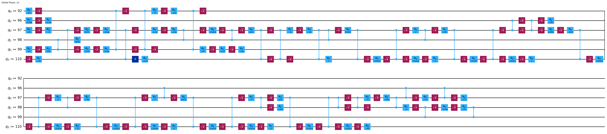

  
  
  
  
  

# 2024 IBM Quantum Challenge Solutions

Worked solutions for all graded components of the 2024 IBM Quantum Challenge run on Qiskit 1.0.\*

### Overview

These sets of labs are intended to do over 10 days. They were designed by IBM Quantum to inform and educate on the updates to the Qiskit SDK (version 1.0 release.)    
The challenge ran between the 5-15th of June.

Notebooks that used to run this are included here: <a href="https://github.com/qiskit-community/ibm-quantum-challenge-2024">Notebook Help</a>. These are largely datasets for questions.

I found out about this on the final day, and did it in 9~ hours. Hence, no bonus lab is included. However, this is all the solutions to the actual challenge. The bonus lab scales up to 50 qubits on a real backend - so note that time on these computers post-challenge may be harder to get.

---

#### Important Lab 3 Note

For Lab 3, you had the option of 4 different labs. I did Circuit Knitting. Why? Because it's cool (and free after the challenge.)     Ciruit Knitting is a way to simplify messy and complex quantum circuits. It's cool, you should have a <a href="https://arxiv.org/pdf/2205.00016">read</a> if you're bored.

- I do not claim to be the official solutions for IBM Quantum, this repository is only to help out curious colleagues with my approaches.
- Excludes bonus lab and initialization Lab 0.

